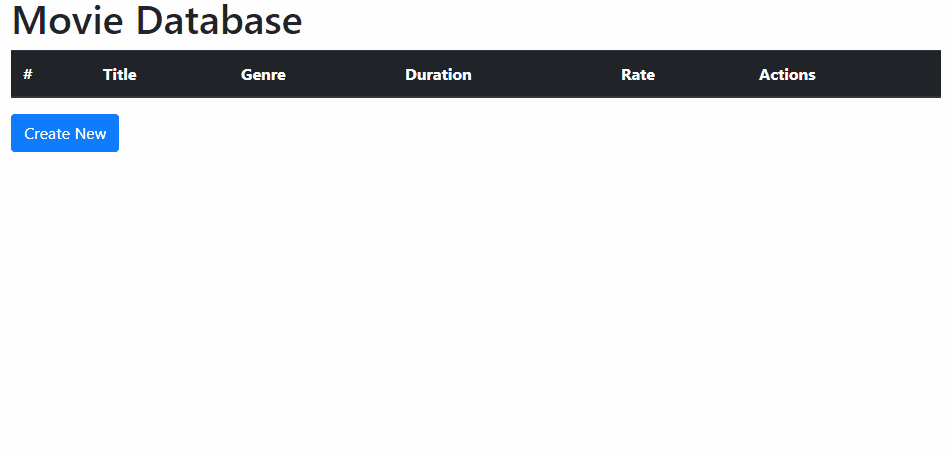

# Python/Django CRUD Base

## Description

This is a CRUD base for Python/Django. It relies only in HTML forms and submits to persist data.

## Demo



## Installation

Clone repository:

```
> clone ...
```

Create virtual environment:

```
> virtualenv env
```

Activate environment:

(Windows)
```
> .\env\Scripts\activate
```

(Linux/MAC)
```
> source ./env/bin/activate
```

Install requirements:

```
(env) > pip install -r requirements.txt
```

## Creating new project

Create project:

```
(env) > django-admin startproject myproject .
```

Create the application:

```
(env) > python manage.py startapp myapp
```

## Configure the App

Add allowed hosts to ```settings.py``` file:

```
ALLOWED_HOSTS = ['*']
```

Add myapp to installed apps array in  ```settings.py``` file:

```
INSTALLED_APPS = [
    ...
    'myapp',
]
```

## Disable Admin App

To reduce the amount of static files, disable admin app in  ```settings.py``` file:

```
INSTALLED_APPS = [
    # 'django.contrib.admin',
    ...
]
```

And disable the path in ```url.py``` file:

```
urlpatterns = [
    # path('admin/', admin.site.urls),
]
```

## Add Static Root to the project

Add STATIC_ROOT to the end of ```settings.py``` file:

```
STATIC_ROOT = os.path.join(BASE_DIR, 'static/')
```

## Finish configuration

Run the following commands to finish the configurarion:

```
(env) > python ./manage.py makemigrations
(env) > python ./manage.py migrate
(env) > python ./manage.py createsuperuser
(env) > python ./manage.py collectstatic
```

## Sample quickstart

Finally run the server:

```
(env) > python manage.py runserver
```

And navigate to ```movies``` App address:

```
http://localhost:8000/movies/
```